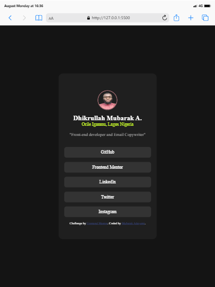
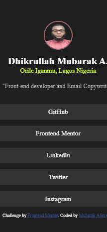
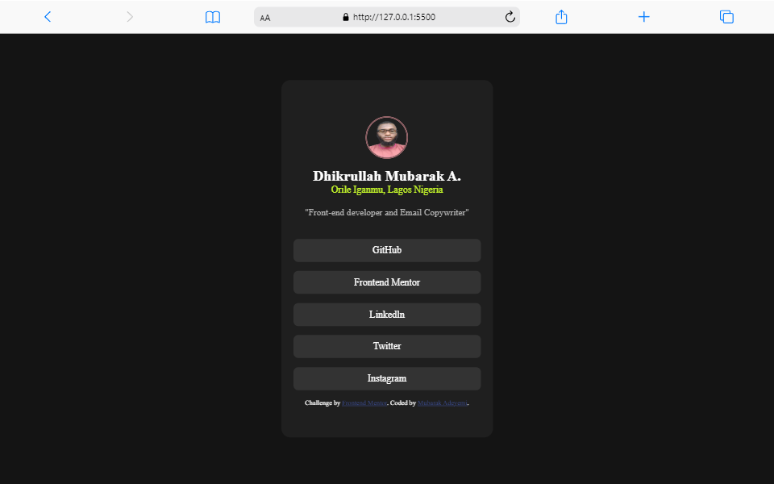

# Frontend Mentor - Social links profile solution

This is a solution to the
[Social links profile challenge on Frontend Mentor](https://www.frontendmentor.io/challenges/social-links-profile-UG32l9m6dQ).
Frontend Mentor challenges help you improve your coding skills by building
realistic projects.

## Table of contents

- [Overview](#overview)
  - [The challenge](#the-challenge)
  - [Screenshot](#screenshot)
  - [Links](#links)
- [My process](#my-process)
  - [Built with](#built-with)
  - [What I learned](#what-i-learned)
  - [Continued development](#continued-development)
  - [Useful resources](#useful-resources)
- [Author](#author)
- [Acknowledgments](#acknowledgments)

## Overview

### The challenge

Users should be able to:

- See hover and focus states for all interactive elements on the page

### Screenshot







### Links

- Solution URL:
  [Add solution URL here](https://github.com/Mubarak-Adeyemi/social-links-profile-main)
- Live Site URL:
  [Add live site URL here](https://mubarak-adeyemi.github.io/social-links-profile-main/)

## My process

### Built with

- Semantic HTML5 markup
- CSS custom properties
- Flexbox

### What I learned

While working on this project, I learned how to utilize Flexbox for layout
design. I also practiced using CSS custom properties and creating responsive,
mobile-first web pages.

Below are some code snippets that showcase what I learned:

```html
<h2 class="name">Dhikrullah Mubarak A.</h2>
```

```css
.social {
  background-color: hsl(0, 0%, 20%);
  margin: 15px 0;
  padding: 10px 0;
  border-radius: 8px;
  width: 100%;
  transition: all 0.5s ease;
}
```

### Continued development

In future projects, I want to continue improving my skills with responsive
design and CSS animations. I am also looking to deepen my understanding of
JavaScript and React for more dynamic web applications.

### Useful resources

- MDN Web Docs - This is a great resource for understanding the core concepts of
  web development. It provides comprehensive documentation and examples.
- Universe.io - This open-source UI element library was particularly useful for
  finding and using buttons in my project.

## Author

Frontend Mentor - (https://www.frontendmentor.io/profile/Mubarak-Adeyemi)
Twitter - (https://www.twitter.com/mubarakElarabiy)

## Acknowledgments

I would like to thank Frontend Mentor for providing this challenge, which was a
great opportunity to practice and improve my HTML and CSS skills.
